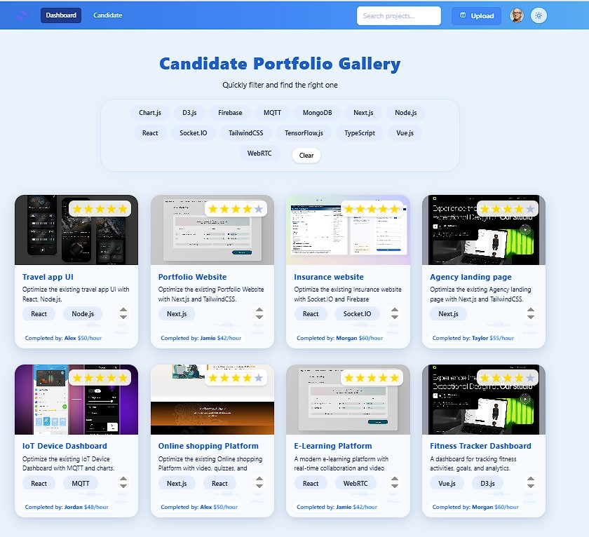
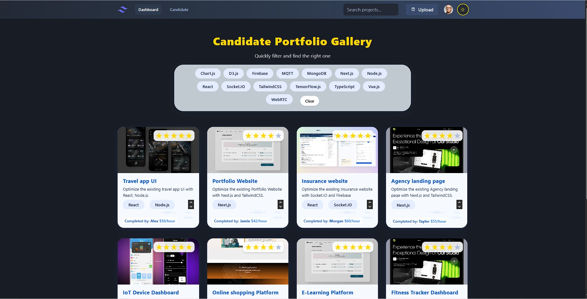
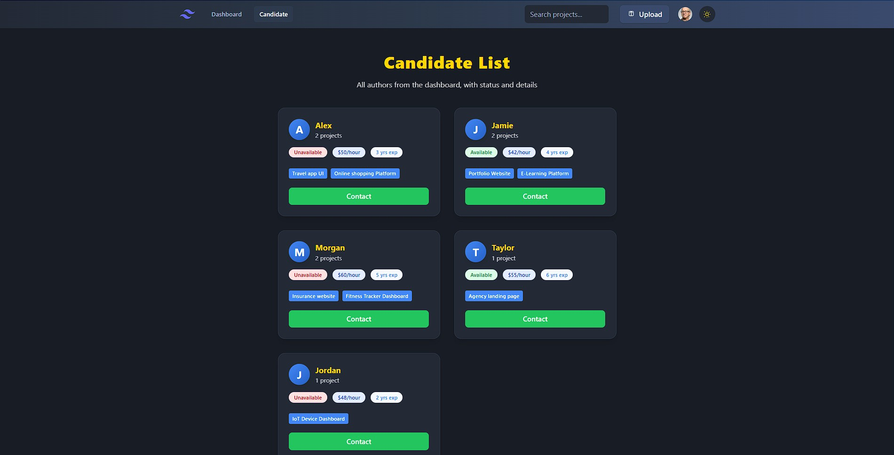
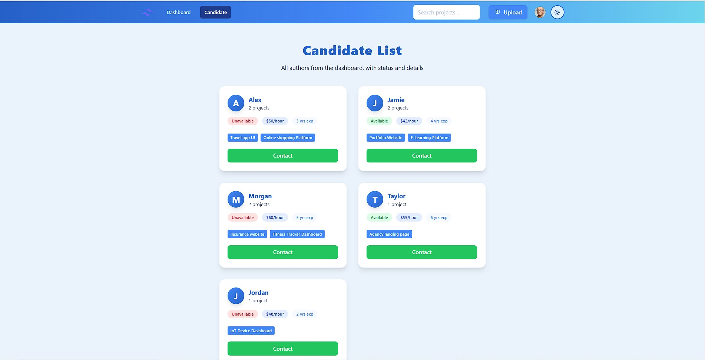
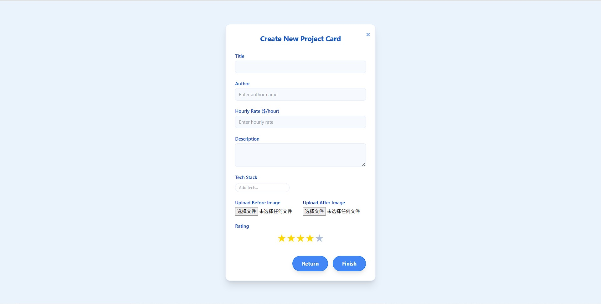
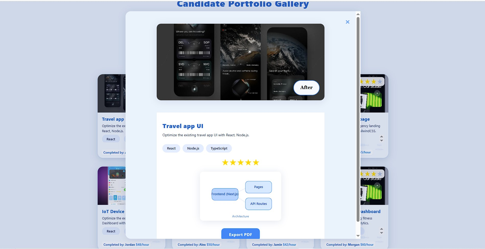

# My-portfolio_design

A modern portfolio and candidate dashboard built with Next.js, React, and TailwindCSS.

## Features

- Project gallery with before/after comparison
- Candidate list with contact info
- Project upload and PDF export
- Responsive UI, dark mode support


## 项目截图







## Getting Started

### 1. Clone the repository

```sh
git clone https://github.com/your-username/your-repo-name.git
cd your-repo-name
```

### 2. Install dependencies

```sh
npm install
npm install html2canvas jspdf
```

### 3. Start the development server

```sh
npm run dev
```

Then open [http://localhost:3000](http://localhost:3000) in your browser.

## Build for production

```sh
npm run build
npm start
```

## Notes

- Node.js 16+ is recommended.
- Project screenshots are in the `Assets/` folder. You can update the image names and paths as needed.
- If you add new features, please update this README.

## License

MIT


